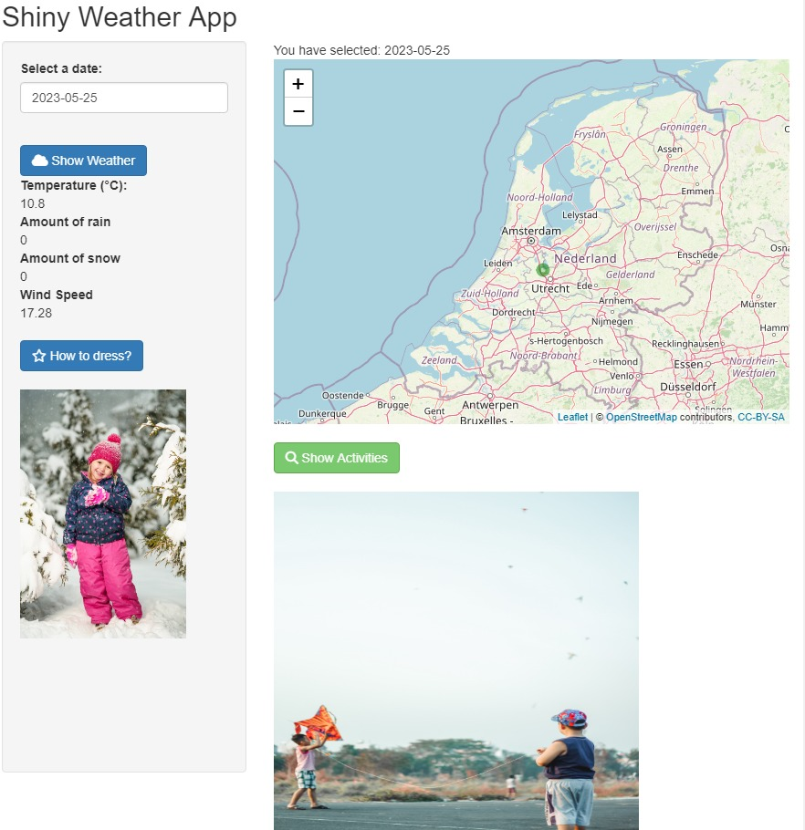

```{r, include = FALSE}
knitr::opts_chunk$set(
  collapse = TRUE,
  comment = "#>"
)
```

```{r setup, echo = FALSE}
library(ShinyWeather)
```


```{r, fig.cap="Screenshot Example", out.width = "80%", echo = FALSE}
 
```

# Description

Description of the purpose of the app

# Running the app

## Installation

Description of installation of app

## How to run the App

Explain how the shiny app should be started


# Features

Showcase the features of the app with screenshots and explain all the input fields

# Conclusion

Wrapping up the report

