```{r, include = FALSE}
knitr::opts_chunk$set(
  collapse = TRUE,
  comment = "#>"
)
```

```{r setup, echo = FALSE}
library(ShinyWeather)
```


```{r, fig.cap="Screenshot Example", out.width = "80%", echo = FALSE}
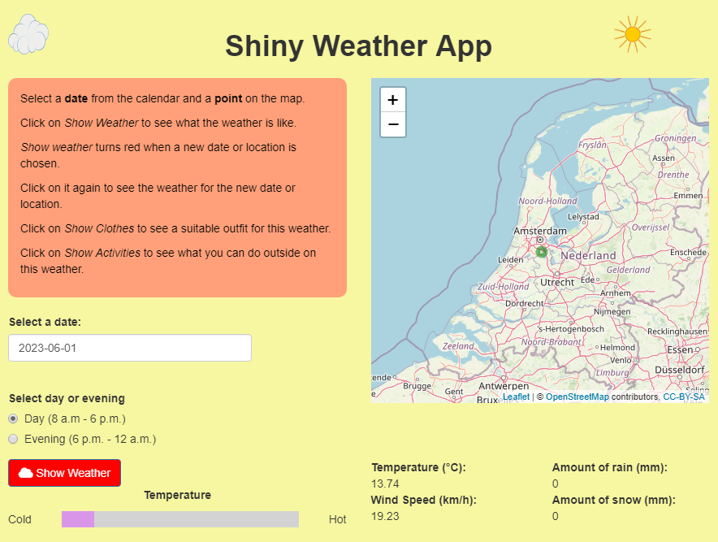 
```

# Description

The **ShinyWeather** app gives the weather forecast for 7 days in any location around the world.It is an app that helps parents explain the weather forecast to their children.
It gives suggestions to children about how to dress on a specific weather and what activities can be done.
The app is meant to be used by younger children together with their parents or by older children alone.

ShinyWeather obtains the weather forcast throguh an API from the Open-Meteo website.

# Running the app

## Installation

To install the ShinyWheater package, run the following command in the R console:


```{r,  echo = TRUE, eval = FALSE}
remotes::install_github("Programming-The-Next-Step-2023/ShinyWheater")
```

## How to run the App

The ShinyWeather App can be started by running the function runShinyWeather().
The weather will be shown only if your computer has an internet connection. If there is no internet connection there will be an error message:

```{r, fig.cap="Error if no internet", out.width = "80%", echo = FALSE}
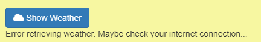 
```
This message will also appear if there are other problems with retrieving the data from the Open-Meteo website.

# Features


**Calendar**. Under "Select a date" there is a calendar where the user can click to select a day.
The dates availanle are the current day and six consecutive days in the future.

```{r, fig.cap="The Calendar", out.width = "80%", echo = FALSE}
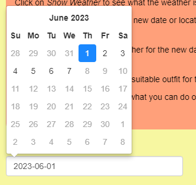 
```


**Map**. The map field contains a map of the world. The user can zoom in and out on the map using the plus and minus signes.
The map's default location is Amsterdam, the Netherlands.A green circle appears on the map at the current selected location.
The user can click on the map to select a new location. 

```{r, fig.cap="The Map", out.width = "80%", echo = FALSE}
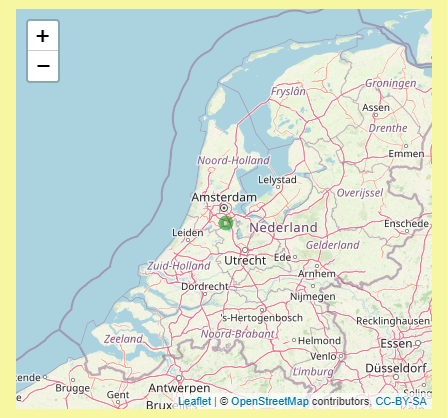

```


*Instructions**. The orange text field contains instructions of how to use the app.

```{r, fig.cap="Instructions", out.width = "80%", echo = FALSE}
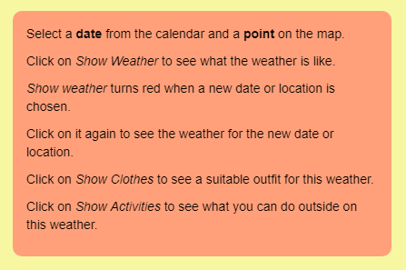

```

**Day/Evening Mode**. Under the calendar there are two radio buttons called "Day" and "Evening"
When "Day" is selected, the app goes into the yellow mode and the data is displayed for the time of the day 
between 8 a.m. and 6 p.m. and when "Evening" is selected, the app does into the dark blue mode and the data is 
displayed for the time of the day between 6 p.m. and 12 a.m.

```{r, fig.cap="Day/Evening Mode", out.width = "80%", echo = FALSE}
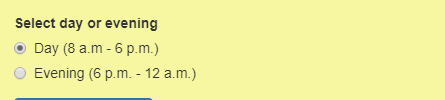
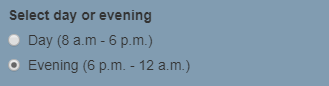
```

**Show Weather Button**. When the user clicks this button, four weather variables are displayed on the screen, based on the day and location selected.When a new location and date is selected, this button turns red.If it is clicked again, the new values are displayed.
```{r, fig.cap="Show Weather Button", out.width = "80%", echo = FALSE}
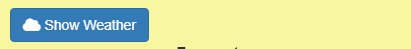

```

**Weather Bars**. When the weather values are displayed, 4 bars are filled in to give a better sense of how the weather is like.

```{r, fig.cap="Show Weather Button", out.width = "80%", echo = FALSE}
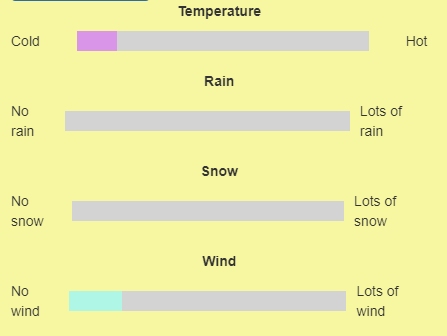

```


**Show Clothes Button**.When weather has been displayed, the user can click "Show Clothes" and a pictue of an outfit will be displayed.
The picture is selected talking into account temperature, rain and snow. Under the picture, there will be a text description.

```{r, fig.cap="Show Clothes Button", out.width = "80%", echo = FALSE}
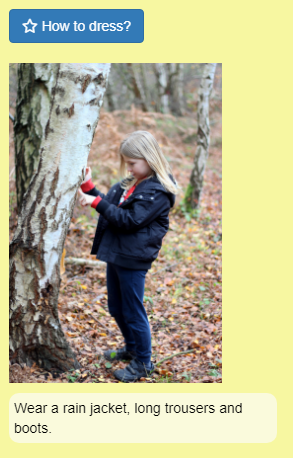

```

**Show Activities Button**.When weather has been displayed, the user can click "Show Activities" and a pictue of one activity will be displayed on the screen. Under the picture, there will be a text description.
The picture is selected talking into account temperature, rain, snow and wind.

```{r, fig.cap="Show Activities Button", out.width = "80%", echo = FALSE}
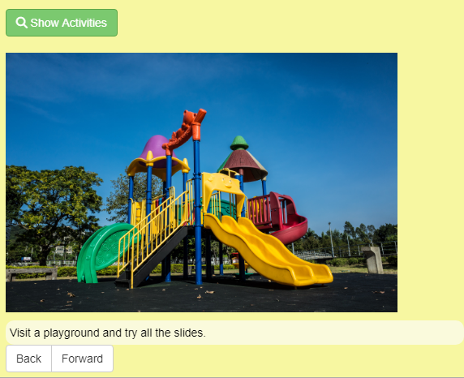

```

**Back and Forward Buttons**.Under the activity image there are two buttons: "Back" and "Forward". The user can click on these buttons to browse to a collection of activities suitable for the current weather.

```{r, fig.cap="Back and Forward Buttons", out.width = "80%", echo = FALSE}
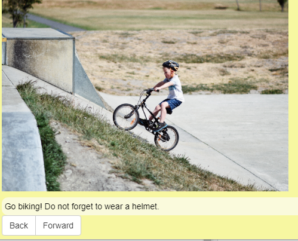

```


# Conclusion

Wrapping up the report

